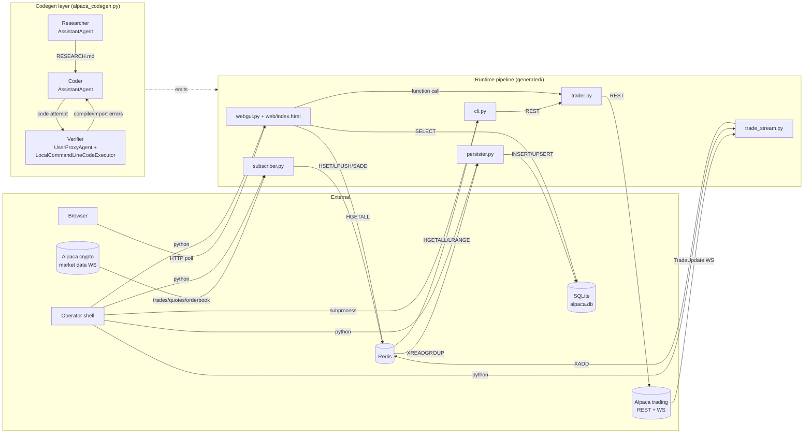
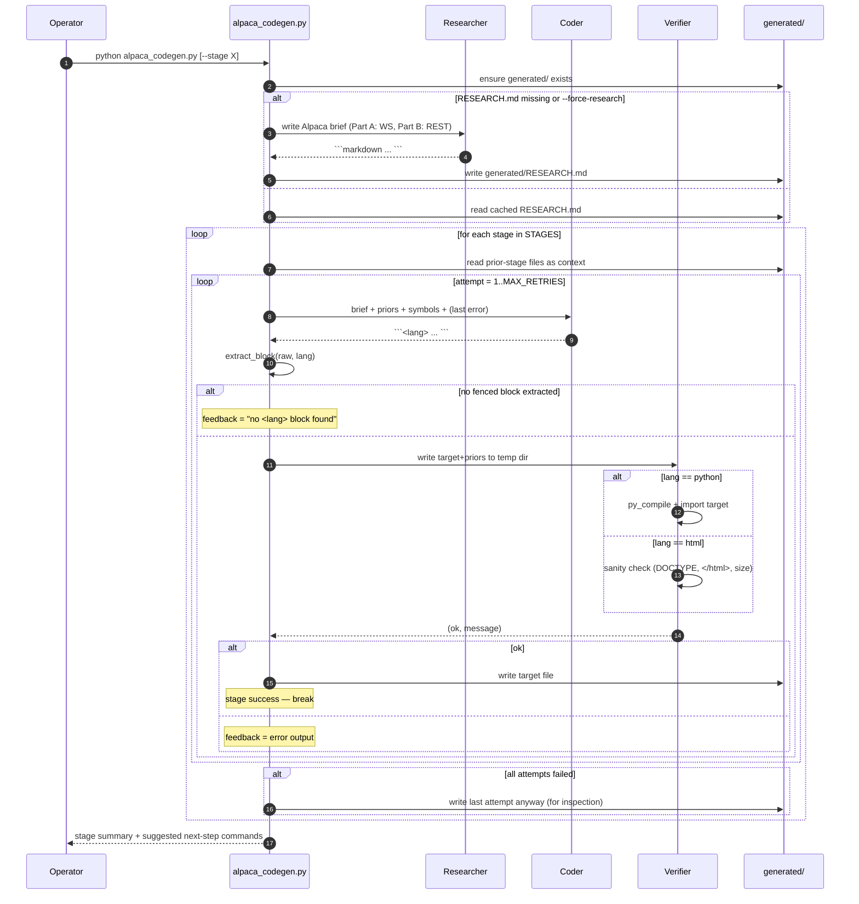
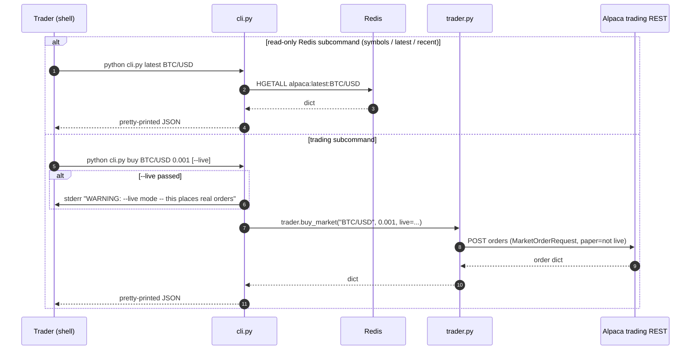

# DESIGN.md — Trading-With-Alpaca

This document describes the **two layers** of this repository:

1. **The codegen layer** (`alpaca_codegen.py`) — an AG2 (autogen) multi-agent
   system that **writes** the runtime pipeline.
2. **The runtime pipeline** (everything under `generated/`) — the actual
   Alpaca crypto paper-trading system: market-data subscriber, trading
   client, CLI, trade-update stream, SQLite persister, and Flask web UI.

The codegen exists so that the runtime is itself a reproducible LLM artifact
— bug fixes can be applied either as direct edits to a generated file
(fast) or as edits to the prompt + regen (durable).

---

## 1. High-level component diagram



**Why this shape.** The pipeline is split into independent long-running
workers so that any one of them can crash and restart without losing data.
Redis is the shared substrate: subscriber writes market data into Redis
keys; trade_stream writes trade events into a Redis Stream; persister is a
consumer-group reader that drains the stream into SQLite. The split between
`trade_stream → Redis Stream → persister` is deliberate — persister can
replay from the last acked id after a crash.

---

## 2. Codegen layer

### 2.1 Agents

The codegen uses three AG2 agents, all backed by Gemini via OpenRouter
(default `google/gemini-3.1-pro-preview`, override with `GEMINI_MODEL`).

| Agent        | AG2 class                       | Role                                                                                 |
| ------------ | ------------------------------- | ------------------------------------------------------------------------------------ |
| **Researcher** | `AssistantAgent`               | Produces `generated/RESEARCH.md`: a brief on the Alpaca crypto WS + trading REST API. Run once and cached; rerun via `--force-research`. |
| **Coder**    | `AssistantAgent`                | Per stage, emits the full source of one target file in a single fenced code block. Reads the brief + earlier stages' files as context. |
| **Verifier** | `UserProxyAgent` + `LocalCommandLineCodeExecutor` | For Python stages: `python -m py_compile` then `import` in a temp dir. For HTML: sanity check (DOCTYPE, closing `</html>`, non-trivial size). On failure feeds the error back to the Coder for up to `MAX_RETRIES=5` attempts. |

The agents collaborate with **manual orchestration** in `run_stage()` — there
is no `GroupChat` and no agent-to-agent autonomous chatter. Each Coder
attempt is a single-turn `initiate_chat(... max_turns=1)`; the Verifier
runs synchronously after each turn and feeds errors back as a follow-up
message.

### 2.2 Stages

The `STAGES` list in `alpaca_codegen.py` is an ordered registry of
5-tuples `(stage_name, target_path, lang, system_prompt, prior_files)`.
Each stage's Coder receives the brief, the symbol list (where relevant),
and any **earlier-stage** files as `### EXISTING:` context (not to be
modified — only used for their public surface and conventions).

| # | Stage          | Target                       | Lang   | Priors                                                          |
| - | -------------- | ---------------------------- | ------ | --------------------------------------------------------------- |
| 0 | `subscriber`   | `subscriber.py`              | python | —                                                               |
| 1 | `trader`       | `trader.py`                  | python | —                                                               |
| 2 | `cli`          | `cli.py`                     | python | subscriber.py, trader.py                                        |
| 3 | `trade_stream` | `trade_stream.py`            | python | trader.py                                                       |
| 4 | `persister`    | `persister.py`               | python | trade_stream.py                                                 |
| 5 | `webgui_html`  | `web/index.html`             | html   | —                                                               |
| 6 | `webgui`       | `webgui.py`                  | python | subscriber.py, trader.py, persister.py, web/index.html          |

The HTML stage was split out because emitting both a Flask backend and a
~500-line HTML/CSS/JS template in one LLM response was timing out at the
32k-output-token boundary. Splitting halved the per-stage burden.

The `--stage <name>` flag runs one stage; `--stage all` regenerates
everything; the default (`missing`) only runs stages whose target file
doesn't yet exist on disk.

### 2.3 Durable rules

`CODER_PREAMBLE` carries a "Durable rules" block that captures lessons
learned from past LLM regressions. Examples currently captured:

- `CryptoDataStream.run()` is sync — never `await` it; use
  `await stream._run_forever()` from inside `asyncio.run(main())`.
- There is no `CryptoExchange` enum — exchange fields are plain strings.
- Redis HSET cannot accept `None` — filter via a `_clean()` helper.
- Alpaca's crypto orderbook websocket delivers **deltas, not snapshots** —
  merge into per-side HASHes (`size>0` → HSET, `size==0` → HDEL).

When a runtime bug recurs after a regen, the right fix is to add a rule to
this block, not to keep patching the generated file.

### 2.4 Codegen sequence



---

## 3. Runtime pipeline

### 3.1 The two halves

**Half 1 — market data (read path):**

`subscriber.py` opens `CryptoDataStream` and subscribes to **trades,
quotes, AND L2 orderbooks** for a configurable symbol list. It writes
into Redis under several keys per symbol; everything downstream
(`cli.py`, `webgui.py`) reads from Redis only.

**Half 2 — trading (write path) and audit:**

`trader.py` is a thin synchronous wrapper over Alpaca's `TradingClient`
(REST). It is used by both `cli.py` and `webgui.py`.

Independently of trader, `trade_stream.py` subscribes to Alpaca's
**trading websocket** (`TradingStream`) and `XADD`s every `TradeUpdate`
event to the Redis Stream `alpaca:trade_updates`. `persister.py` reads
that stream as a consumer group and writes the events into SQLite. This
split lets persister crash and resume without losing events.

### 3.2 Redis schema

| Key / Stream                  | Type   | Writer          | Reader                                  |
| ----------------------------- | ------ | --------------- | --------------------------------------- |
| `alpaca:latest:<SYM>`         | Hash   | subscriber.py   | cli `latest`, webgui `/api/orderbook` fallback |
| `alpaca:recent:<SYM>:trade`   | List   | subscriber.py   | cli `recent`                            |
| `alpaca:recent:<SYM>:quote`   | List   | subscriber.py   | cli `recent`                            |
| `alpaca:orderbook:<SYM>`      | Hash   | subscriber.py   | webgui (metadata only: symbol, timestamp) |
| `alpaca:ob:bids:<SYM>`        | Hash   | subscriber.py   | webgui `/api/orderbook` (price → size)  |
| `alpaca:ob:asks:<SYM>`        | Hash   | subscriber.py   | webgui `/api/orderbook` (price → size)  |
| `alpaca:symbols`              | Set    | subscriber.py   | cli `symbols`, webgui `/api/symbols`    |
| `alpaca:trade_updates`        | Stream | trade_stream.py | persister.py                            |
| `alpaca:recent:trade_updates` | List   | trade_stream.py | (debug only)                            |

The orderbook is **delta-merged** in Redis (Alpaca's WS sends only changed
levels, not snapshots): `size > 0` upserts a level, `size == 0` deletes
it. Webgui sorts and slices to top-10 per side at read time.

### 3.3 SQLite schema (written by `persister.py`)

| Table          | Purpose                                                                          |
| -------------- | -------------------------------------------------------------------------------- |
| `orders`       | Latest known state per `order_id` (UPSERT).                                      |
| `fills`        | Append-only fills, idempotent on `execution_id` (INSERT OR IGNORE).              |
| `trade_events` | Append-only audit log of every `TradeUpdate` event.                              |

### 3.4 Web UI structure

`webgui.py` is a thin Flask backend; `web/index.html` is a self-contained
vanilla-JS frontend (no React, no CDN imports). Three tabs:

| Tab       | Source                                       | Notes                                                                                             |
| --------- | -------------------------------------------- | ------------------------------------------------------------------------------------------------- |
| Escalator | `/api/orderbook/<sym>` (Redis)               | 10 ask rows above 10 bid rows, one price per row, padded to 21-row fixed height. Click a row → modal pre-filled to BUY at that ask / SELL at that bid. Symbol selector is local to this tab. |
| Activity  | `/api/orders`, `/api/fills` (SQLite)         | Manual refresh; cancel button on active orders.                                                   |
| Summary   | `/api/summary` (trader REST + SQLite agg.)   | Account snapshot, positions, realized PnL by symbol.                                              |

Defensive invariant: **no endpoint may 500 on missing data** — empty
Redis returns `[]`/`{}`; missing `alpaca.db` returns `[]`; missing creds
in `/api/summary` returns null/empty blocks.

---

## 4. Use cases

```mermaid
flowchart TB
  Dev(("Developer"))
  Trader(("Trader"))

  subgraph CodegenUC["Codegen use cases"]
    UC1["Generate the entire pipeline<br/>(python alpaca_codegen.py)"]
    UC2["Regenerate one stage<br/>(--stage subscriber|...|webgui)"]
    UC3["Refresh research brief<br/>(--force-research)"]
    UC4["Feed a runtime traceback<br/>back to the Coder<br/>(--fix err.txt --stage X)"]
    UC5["Tune prompt or add<br/>a durable rule"]
  end

  subgraph RuntimeUC["Runtime pipeline use cases"]
    UC6["Start market-data ingest<br/>(python generated/subscriber.py)"]
    UC7["Start trade-event ingest<br/>(python generated/trade_stream.py)"]
    UC8["Start audit persister<br/>(python generated/persister.py)"]
    UC9["Start the Web UI<br/>(python generated/webgui.py)"]
    UC10["Query market data via CLI<br/>(symbols / latest / recent)"]
    UC11["Query account via CLI<br/>(account / positions / orders)"]
    UC12["Place / cancel order via CLI<br/>(buy / sell / cancel)"]
    UC13["Watch live depth ladder"]
    UC14["Click-to-trade via Escalator"]
    UC15["Review activity (orders & fills)"]
    UC16["Inspect account / PnL summary"]
  end

  Dev --- UC1
  Dev --- UC2
  Dev --- UC3
  Dev --- UC4
  Dev --- UC5

  Dev --- UC6
  Dev --- UC7
  Dev --- UC8
  Dev --- UC9
  Dev --- UC10
  Dev --- UC11
  Dev --- UC12

  Trader --- UC9
  Trader --- UC13
  Trader --- UC14
  Trader --- UC15
  Trader --- UC16
```



In practice the same person plays both actor roles (the developer who
runs the codegen also trades on the resulting paper account), but the
two roles are separable: a Trader needs only `webgui.py` running, never
touches the codegen.

---

## 5. Sequence diagrams

### 5.1 Market-data path (subscriber → Redis → Escalator)

```mermaid
sequenceDiagram
  autonumber
  participant Alpaca as Alpaca crypto WS
  participant Sub as subscriber.py
  participant Redis
  participant WG as webgui.py
  participant JS as web/index.html (browser)
  participant User as Trader

  par per-tick
    Alpaca-->>Sub: trade message
    Sub->>Redis: HSET alpaca:latest:<SYM> price/timestamp
    Sub->>Redis: LPUSH alpaca:recent:<SYM>:trade ; LTRIM 0 99
    Sub->>Redis: SADD alpaca:symbols <SYM>
  and
    Alpaca-->>Sub: quote message
    Sub->>Redis: HSET alpaca:latest:<SYM> bid_*/ask_*/timestamp
    Sub->>Redis: LPUSH alpaca:recent:<SYM>:quote ; LTRIM 0 99
  and
    Alpaca-->>Sub: orderbook delta (changed levels only)
    loop for each level in book.bids / book.asks
      alt size > 0
        Sub->>Redis: HSET alpaca:ob:<side>:<SYM> "<price>" <size>
      else size == 0
        Sub->>Redis: HDEL alpaca:ob:<side>:<SYM> "<price>"
      end
    end
    Sub->>Redis: HSET alpaca:orderbook:<SYM> symbol/timestamp
  end

  loop every 1000 ms
    JS->>WG: GET /api/orderbook/<SYM>
    WG->>Redis: HGETALL alpaca:ob:bids:<SYM>
    WG->>Redis: HGETALL alpaca:ob:asks:<SYM>
    WG->>Redis: HGETALL alpaca:orderbook:<SYM>
    WG-->>JS: { bids[:10] (DESC), asks[:10] (ASC), timestamp }
    JS->>JS: render 10 asks (high→low), spread, 10 bids (high→low)
    JS-->>User: visual ladder update
  end
```

### 5.2 Order placement + audit

```mermaid
sequenceDiagram
  autonumber
  participant User as Trader
  participant JS as web/index.html (browser)
  participant WG as webgui.py
  participant TR as trader.py
  participant AlpacaR as Alpaca trading REST
  participant AlpacaWS as Alpaca trading WS
  participant TS as trade_stream.py
  participant Redis
  participant Per as persister.py
  participant SQL as SQLite

  User->>JS: Click ASK row at price P
  Note over JS: open modal, side=BUY, type=limit, limit_price=P
  User->>JS: Enter qty Q, click Submit
  JS->>WG: POST /api/order { symbol, side:buy, type:limit, limit_price:P, qty:Q, live:false }
  WG->>TR: trader.buy_limit(symbol, Q, P, live=False)
  TR->>AlpacaR: POST orders (LimitOrderRequest, paper=True)
  AlpacaR-->>TR: order dict (status=accepted)
  TR-->>WG: dict
  WG-->>JS: 200 { id, status, ... }
  JS-->>User: toast "submitted"

  par independent path
    AlpacaWS-->>TS: TradeUpdate(event=new)
    TS->>Redis: XADD alpaca:trade_updates {json:...}
    TS->>Redis: LPUSH alpaca:recent:trade_updates ; LTRIM
  and
    AlpacaWS-->>TS: TradeUpdate(event=fill, execution_id=E)
    TS->>Redis: XADD alpaca:trade_updates {json:...}
  end

  loop XREADGROUP block=5s count=64
    Per->>Redis: XREADGROUP GROUP persister persister-1 ">" alpaca:trade_updates
    Redis-->>Per: [ (entry_id, {json:payload}), ... ]
    loop per entry
      Per->>Per: parse payload
      Per->>SQL: INSERT INTO trade_events(...)
      alt payload.order_id present
        Per->>SQL: UPSERT orders ON order_id
      end
      alt event in {fill, partial_fill}
        Per->>SQL: INSERT OR IGNORE INTO fills (UNIQUE execution_id)
      end
      Per->>Redis: XACK alpaca:trade_updates persister entry_id
    end
  end

  Note over User,JS: Later: User opens Activity tab
  JS->>WG: GET /api/orders
  WG->>SQL: SELECT * FROM orders ORDER BY submitted_at DESC LIMIT 50
  SQL-->>WG: rows
  WG-->>JS: JSON
  JS-->>User: table of recent orders + fills
```

### 5.3 CLI query path (no UI involved)



---

## 6. Key invariants worth preserving across regenerations

These are the design promises the codebase makes; they're encoded in the
`*_SYS` prompts and (most of them) in the `CODER_PREAMBLE` durable rules.

1. **Paper trading is the default everywhere.** `live=True` / `--live` is
   the only way to opt into real money. CLI prints a stderr warning before
   any `--live` action.
2. **No network at import time.** Every generated module reads env vars
   and opens connections inside `main()` / `get_client()` only — never at
   module top level. This is what lets the verifier `import` each module
   without real creds or a Redis server.
3. **Independent restartability.** Each long-running worker (subscriber,
   trade_stream, persister, webgui) can crash and restart without losing
   data. Redis Stream + consumer-group acks are what make persister safe.
4. **Defensive web rendering.** No webgui endpoint may 500 on missing
   data — Redis empty → `[]`/`{}`, SQLite missing → `[]`, creds missing →
   null/empty summary blocks.
5. **Crypto TIF.** Use `TimeInForce.GTC` (or `IOC`) — `DAY` is rejected
   by Alpaca for crypto. Use `qty=`, not `notional=`.
6. **Orderbook merge semantics.** Subscriber must merge orderbook deltas
   into per-side HASHes; never overwrite the whole book.
